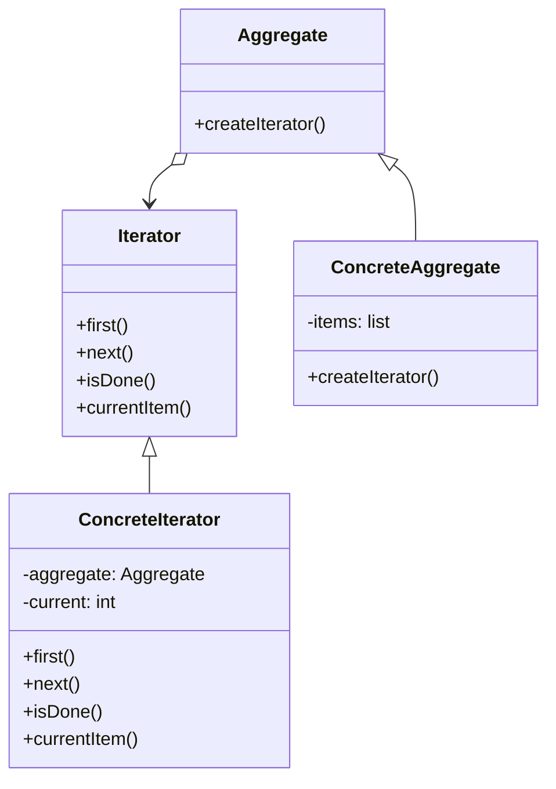

# Iterator Pattern
--


```mermaid
classDiagram
direction TB

Iterator <|-- ConcreteIterator
Aggregate <|-- ConcreteAggregate
Aggregate o--> Iterator

class Iterator {
  +first()
  +next()
  +isDone()
  +currentItem()
}

class ConcreteIterator {
  -aggregate: Aggregate
  -current: int
  +first()
  +next()
  +isDone()
  +currentItem()
}

class Aggregate {
  +createIterator()
}

class ConcreteAggregate {
  -items: list
  +createIterator()
}
```

## implemetation in python:

```python

```
# JavaScrip implementation:

```js

```

## [Back to main](../readme.md)