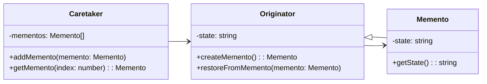

# Memento Pattern
The Memento Pattern is a behavioral design pattern that allows the capturing and externalizing of an object's internal state without violating encapsulation, and thereby allowing the object to be restored to that state later. It is useful when there is a need to implement undo-redo operations in an application.



## implemetation in python:
```python
class Memento:
    def __init__(self, state):
        self._state = state

    def get_saved_state(self):
        return self._state

class Originator:
    def __init__(self):
        self._state = None

    def set_state(self, state):
        print("Setting state to: " + state)
        self._state = state

    def save_state(self):
        return Memento(self._state)

    def restore_state(self, memento):
        self._state = memento.get_saved_state()
        print("State after restoring from Memento: " + self._state)

class Caretaker:
    def __init__(self, originator):
        self._originator = originator
        self._mementos = []

    def save_state(self):
        self._mementos.append(self._originator.save_state())

    def undo(self):
        if not self._mementos:
            return None
        last_memento = self._mementos.pop()
        self._originator.restore_state(last_memento)

originator = Originator()
care_taker = Caretaker(originator)

originator.set_state("state 1")
care_taker.save_state()

originator.set_state("state 2")
care_taker.save_state()

originator.set_state("state 3")
care_taker.save_state()

# Restore to state 2
care_taker.undo() # Output: State after restoring from Memento: state 2

# Restore to state 1
care_taker.undo() # Output: State after restoring from Memento: state 1

```
# JavaScrip implementation:

```js
class Memento {
    constructor(state) {
        this._state = state;
    }

    get savedState() {
        return this._state;
    }
}

class Originator {
    constructor() {
        this._state = null;
    }

    set state(state) {
        console.log(`Setting state to: ${state}`);
        this._state = state;
    }

    saveState() {
        return new Memento(this._state);
    }

    restoreState(memento) {
        this._state = memento.savedState;
        console.log(`State after restoring from Memento: ${this._state}`);
    }
}

class Caretaker {
    constructor(originator) {
        this._originator = originator;
        this._mementos = [];
    }

    saveState() {
        this._mementos.push(this._originator.saveState());
    }

    undo() {
        if (this._mementos.length === 0) {
            return null;
        }
        const lastMemento = this._mementos.pop();
        this._originator.restoreState(lastMemento);
    }
}

const originator = new Originator();
const careTaker = new Caretaker(originator);

originator.state = "state 1";
careTaker.saveState();

originator.state = "state 2";
careTaker.saveState();

originator.state = "state 3";
careTaker.saveState();

// Restore to state 2
careTaker.undo(); // Output: State after restoring from Memento: state 2

// Restore to state 1
careTaker.undo(); // Output:

```

## [Back to main](../readme.md)