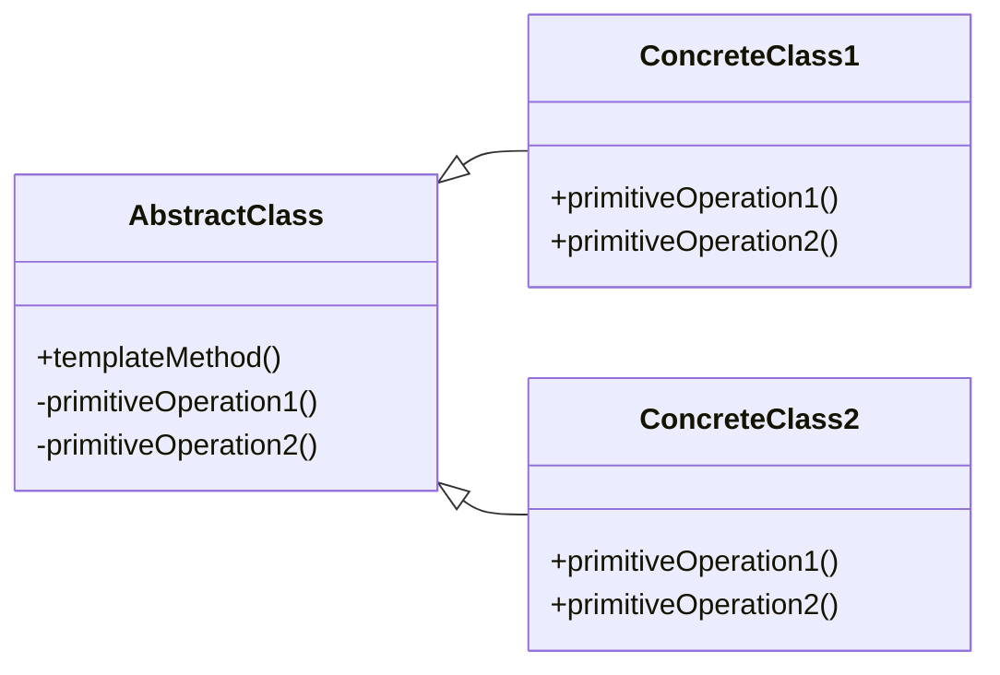

# Template Method Pattern
The Template Method pattern is a behavioral design pattern that defines the skeleton of an algorithm in a base class and allows subclasses to provide specific implementation details without altering the algorithm's structure. This pattern is useful when you have a complex algorithm that can be divided into a series of smaller steps, and the steps' implementation may vary based on the context.

In the Template Method pattern, the base class provides a template method that calls other methods, which may be implemented in the subclass. The template method usually consists of a series of steps that need to be performed in order, and the subclass can provide custom implementations for each step.


## implemetation in python:
```python
from abc import ABC, abstractmethod


class Pizza(ABC):
    def make_pizza(self):
        self.prepare_dough()
        self.add_toppings()
        self.bake()

    def prepare_dough(self):
        print("Preparing pizza dough")

    @abstractmethod
    def add_toppings(self):
        pass

    def bake(self):
        print("Baking pizza")


class MargheritaPizza(Pizza):
    def add_toppings(self):
        print("Adding tomato sauce and cheese")


class PepperoniPizza(Pizza):
    def add_toppings(self):
        print("Adding tomato sauce, cheese, and pepperoni")


if __name__ == '__main__':
    margherita = MargheritaPizza()
    margherita.make_pizza()

    pepperoni = PepperoniPizza()
    pepperoni.make_pizza()

```
# JavaScrip implementation:

```js
// Abstract Class
class House {
  build() {
    this.buildFoundation();
    this.buildWalls();
    this.buildRoof();
  }

  buildFoundation() {
    console.log('Building the foundation');
  }

  buildWalls() {
    console.log('Building the walls');
  }

  buildRoof() {
    console.log('Building the roof');
  }
}

// Concrete Class
class WoodenHouse extends House {
  buildFoundation() {
    console.log('Building the wooden foundation');
  }

  buildWalls() {
    console.log('Building the wooden walls');
  }

  buildRoof() {
    console.log('Building the wooden roof');
  }
}

// Client Code
const woodenHouse = new WoodenHouse();
woodenHouse.build();

```

## [Back to main](../readme.md)