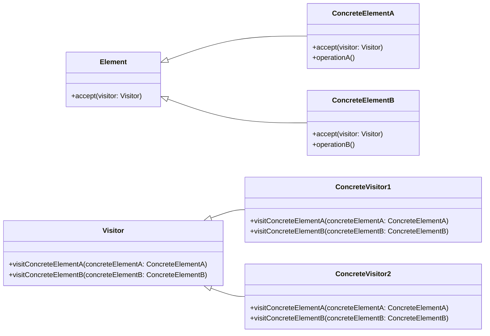

# Visitor Pattern
--
TODO

```mermaid
classDiagram
direction LR

Element <|-- ConcreteElementA
Element <|-- ConcreteElementB
Visitor <|-- ConcreteVisitor1
Visitor <|-- ConcreteVisitor2

class Element {
  +accept(visitor: Visitor)
}

class ConcreteElementA {
  +accept(visitor: Visitor)
  +operationA()
}

class ConcreteElementB {
  +accept(visitor: Visitor)
  +operationB()
}

class Visitor {
  +visitConcreteElementA(concreteElementA: ConcreteElementA)
  +visitConcreteElementB(concreteElementB: ConcreteElementB)
}

class ConcreteVisitor1 {
  +visitConcreteElementA(concreteElementA: ConcreteElementA)
  +visitConcreteElementB(concreteElementB: ConcreteElementB)
}

class ConcreteVisitor2 {
  +visitConcreteElementA(concreteElementA: ConcreteElementA)
  +visitConcreteElementB(concreteElementB: ConcreteElementB)
}
```

## implemetation in python:
```python
TODO
```
# JavaScrip implementation:

```js
TODO
```

## [Back to main](../readme.md)