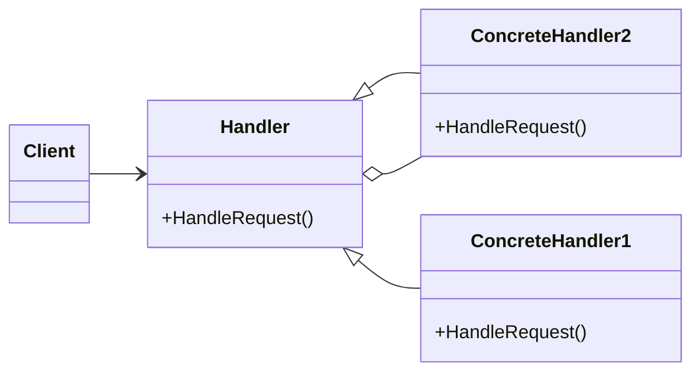

# Chain of Responsibility
Avoids coupling the sender of a request to its receiver by giving more than one object a chance to handle the request
---
$~$

$~$
## implemetation in python:
<a href="https://en.wikipedia.org/wiki/Abstract_factory_pattern" target="_blank">wikipedia</a>
```python
from abc import ABC, abstractmethod
from sys import platform


class Button(ABC):
    @abstractmethod
    def paint(self):
        pass


class LinuxButton(Button):
    def paint(self):
        return "Render a button in a Linux style"


class WindowsButton(Button):
    def paint(self):
        return "Render a button in a Windows style"


class MacOSButton(Button):
    def paint(self):
        return "Render a button in a MacOS style"


class GUIFactory(ABC):
    @abstractmethod
    def create_button(self):
        pass


class LinuxFactory(GUIFactory):
    def create_button(self):
        return LinuxButton()


class WindowsFactory(GUIFactory):
    def create_button(self):
        return WindowsButton()


class MacOSFactory(GUIFactory):
    def create_button(self):
        return MacOSButton()


if platform == "linux":
    factory = LinuxFactory()
elif platform == "darwin":
    factory = MacOSFactory()
elif platform == "win32":
    factory = WindowsFactory()
else:
    raise NotImplementedError(f"Not implemented for your platform: {platform}")

button = factory.create_button()
result = button.paint()
print(result)
```
# JavaScrip implementation:

```js
function Employee(name) {
    this.name = name;

    this.say = function () {
        console.log("I am employee " + name);
    };
}

function EmployeeFactory() {

    this.create = function (name) {
        return new Employee(name);
    };
}

function Vendor(name) {
    this.name = name;

    this.say = function () {
        console.log("I am vendor " + name);
    };
}

function VendorFactory() {

    this.create = function (name) {
        return new Vendor(name);
    };
}

function run() {
    var persons = [];
    var employeeFactory = new EmployeeFactory();
    var vendorFactory = new VendorFactory();

    persons.push(employeeFactory.create("Joan DiSilva"));
    persons.push(employeeFactory.create("Tim O'Neill"));
    persons.push(vendorFactory.create("Gerald Watson"));
    persons.push(vendorFactory.create("Nicole McNight"));

    for (var i = 0, len = persons.length; i < len; i++) {
        persons[i].say();
    }
}

```

## [Back to main](../readme.md)