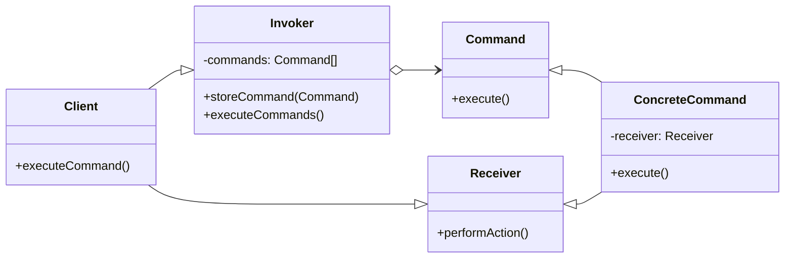

# Command Pattern
The Command pattern is a behavioral design pattern that turns requests into objects, allowing the client to encapsulate actions and parameters. The Command pattern can be used to implement undo-redo operations, queue requests, log requests, or support transactions.

In the Command pattern, requests are encapsulated as objects, which decouples the requester from the object that performs the action. The requester does not need to know anything about the action being performed, except for the Command object that represents the action.
--



## implemetation in python:
```python
# Command interface
class Command:
    def execute(self):
        pass

# Receiver
class Light:
    def turn_on(self):
        print('Light is on')

    def turn_off(self):
        print('Light is off')

# Concrete commands
class TurnOnCommand(Command):
    def __init__(self, light):
        self.light = light

    def execute(self):
        self.light.turn_on()

class TurnOffCommand(Command):
    def __init__(self, light):
        self.light = light

    def execute(self):
        self.light.turn_off()

# Invoker
class RemoteControl:
    def __init__(self):
        self.commands = {}

    def register(self, command_name, command):
        self.commands[command_name] = command

    def execute(self, command_name):
        command = self.commands.get(command_name)
        if command:
            command.execute()

# Client
if __name__ == '__main__':
    light = Light()
    turn_on = TurnOnCommand(light)
    turn_off = TurnOffCommand(light)

    remote = RemoteControl()
    remote.register('on', turn_on)
    remote.register('off', turn_off)

    remote.execute('on')
    remote.execute('off')

```
# JavaScrip implementation:

```js
# Command interface
class Command:
    def execute(self):
        pass

# Receiver
class Light:
    def turn_on(self):
        print('Light is on')

    def turn_off(self):
        print('Light is off')

# Concrete commands
class TurnOnCommand(Command):
    def __init__(self, light):
        self.light = light

    def execute(self):
        self.light.turn_on()

class TurnOffCommand(Command):
    def __init__(self, light):
        self.light = light

    def execute(self):
        self.light.turn_off()

# Invoker
class RemoteControl:
    def __init__(self):
        self.commands = {}

    def register(self, command_name, command):
        self.commands[command_name] = command

    def execute(self, command_name):
        command = self.commands.get(command_name)
        if command:
            command.execute()

# Client
if __name__ == '__main__':
    light = Light()
    turn_on = TurnOnCommand(light)
    turn_off = TurnOffCommand(light)

    remote = RemoteControl()
    remote.register('on', turn_on)
    remote.register('off', turn_off)

    remote.execute('on')
    remote.execute('off')
```

## [Back to main](../readme.md)