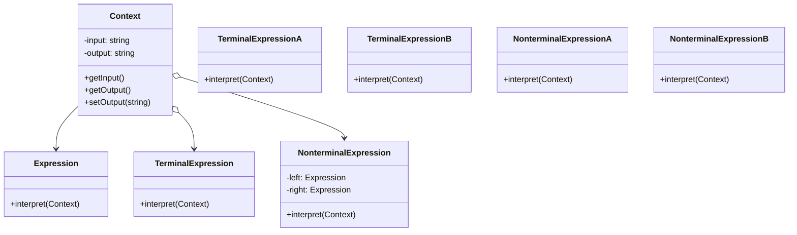

# Interpreter Pattern

In the Interpreter Pattern, you define a set of language rules or grammar, and then create classes that can interpret those rules. These classes represent various components of the language, such as operators, operands, and other constructs. The Interpreter Pattern makes it possible to define a language that can be interpreted by a computer program, which can then execute the instructions in the language.



## implemetation in python:
```python
class Context:
    def __init__(self, input_str):
        self.input_str = input_str
        self.output_str = ''

class Expression:
    def interpret(self, context):
        pass

class UpperCaseExpression(Expression):
    def __init__(self, expr):
        self.expr = expr

    def interpret(self, context):
        self.expr.interpret(context)
        context.output_str = context.output_str.upper()

class LowerCaseExpression(Expression):
    def __init__(self, expr):
        self.expr = expr

    def interpret(self, context):
        self.expr.interpret(context)
        context.output_str = context.output_str.lower()

class InputExpression(Expression):
    def interpret(self, context):
        context.output_str = context.input_str

# usage
input_str = 'Hello World!'
context = Context(input_str)
expression = LowerCaseExpression(UpperCaseExpression(InputExpression()))

expression.interpret(context)

print(f'Input: {context.input_str}')
print(f'Output: {context.output_str}')

```
# JavaScrip implementation:

```js
class Context {
  constructor(inputStr) {
    this.inputStr = inputStr;
    this.outputStr = '';
  }
}

class Expression {
  interpret(context) {}
}

class UpperCaseExpression extends Expression {
  constructor(expr) {
    super();
    this.expr = expr;
  }

  interpret(context) {
    this.expr.interpret(context);
    context.outputStr = context.outputStr.toUpperCase();
  }
}

class LowerCaseExpression extends Expression {
  constructor(expr) {
    super();
    this.expr = expr;
  }

  interpret(context) {
    this.expr.interpret(context);
    context.outputStr = context.outputStr.toLowerCase();
  }
}

class InputExpression extends Expression {
  interpret(context) {
    context.outputStr = context.inputStr;
  }
}

// usage
const inputStr = 'Hello World!';
const context = new Context(inputStr);
const expression = new LowerCaseExpression(
  new UpperCaseExpression(new InputExpression())
);

expression.interpret(context);

console.log(`Input: ${context.inputStr}`);
console.log(`Output: ${context.outputStr}`);

```

## [Back to main](../readme.md)