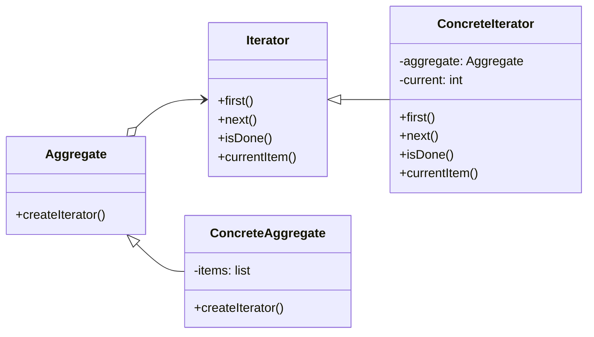

# Iterator Pattern
--
The Iterator pattern provides a way to traverse through a collection of objects without exposing the underlying representation of the collection. The pattern separates the way of accessing the elements from the way the elements are stored, which makes it easier to change the traversal method or the underlying collection.
In the Iterator pattern, a separate iterator object is created, which encapsulates the traversal state and knows how to access the elements of the collection. The iterator provides a common interface for traversing through the collection, and clients can use the iterator to access the elements without worrying about the details of the collection's implementation.



## implemetation in python:

```python
class ListIterator:
    def __init__(self, collection):
        self.collection = collection
        self.current = 0

    def has_next(self):
        return self.current < len(self.collection)

    def next(self):
        if self.has_next():
            value = self.collection[self.current]
            self.current += 1
            return value
        else:
            return None

class ListCollection:
    def __init__(self):
        self.collection = []

    def add(self, item):
        self.collection.append(item)

    def create_iterator(self):
        return ListIterator(self.collection)

collection = ListCollection()
collection.add(1)
collection.add(2)
collection.add(3)

iterator = collection.create_iterator()
while iterator.has_next():
    print(iterator.next())

```
# JavaScrip implementation:

```js
class ListIterator {
  constructor(collection) {
    this.collection = collection;
    this.current = 0;
  }

  hasNext() {
    return this.current < this.collection.length;
  }

  next() {
    if (this.hasNext()) {
      const value = this.collection[this.current];
      this.current++;
      return value;
    } else {
      return null;
    }
  }
}

class ListCollection {
  constructor() {
    this.collection = [];
  }

  add(item) {
    this.collection.push(item);
  }

  createIterator() {
    return new ListIterator(this.collection);
  }
}

const collection = new ListCollection();
collection.add(1);
collection.add(2);
collection.add(3);

const iterator = collection.createIterator();
while (iterator.hasNext()) {
  console.log(iterator.next());
}

```

## [Back to main](../readme.md)