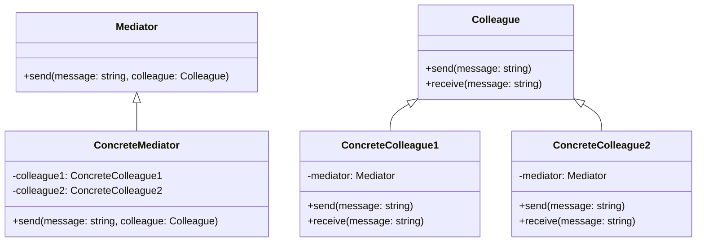

# Mediator Pattern
The Mediator pattern is used to manage communication between multiple objects, where objects don't communicate with each other directly, but instead, they communicate through a mediator object that acts as an intermediary. The mediator pattern helps reduce coupling among objects and provides a more organized way for objects to communicate.

An example use case of the mediator pattern is in a chat application, where multiple users can communicate with each other. Instead of users communicating directly with each other, a mediator object can be used to manage and route messages among the users.

TODO


## implemetation in python:
```python
class Mediator:
    def __init__(self):
        self.users = []

    def add_user(self, user):
        self.users.append(user)

    def send_message(self, message, sender):
        for user in self.users:
            if user != sender:
                user.receive_message(message)

class User:
    def __init__(self, name, mediator):
        self.name = name
        self.mediator = mediator

    def send_message(self, message):
        self.mediator.send_message(message, self)

    def receive_message(self, message):
        print(f'{self.name} received message: {message}')

# Example usage
mediator = Mediator()

user1 = User('Alice', mediator)
user2 = User('Bob', mediator)

mediator.add_user(user1)
mediator.add_user(user2)

user1.send_message('Hello Bob')
user2.send_message('Hi Alice')

```
# JavaScrip implementation:

```js
class Mediator {
  constructor() {
    this.users = [];
  }

  addUser(user) {
    this.users.push(user);
  }

  sendMessage(message, sender) {
    this.users.forEach((user) => {
      if (user !== sender) {
        user.receiveMessage(message);
      }
    });
  }
}

class User {
  constructor(name, mediator) {
    this.name = name;
    this.mediator = mediator;
  }

  sendMessage(message) {
    this.mediator.sendMessage(message, this);
  }

  receiveMessage(message) {
    console.log(`${this.name} received message: ${message}`);
  }
}

// Example usage
const mediator = new Mediator();

const user1 = new User('Alice', mediator);
const user2 = new User('Bob', mediator);

mediator.addUser(user1);
mediator.addUser(user2);

user1.sendMessage('Hello Bob');
user2.sendMessage('Hi Alice');

```

## [Back to main](../readme.md)