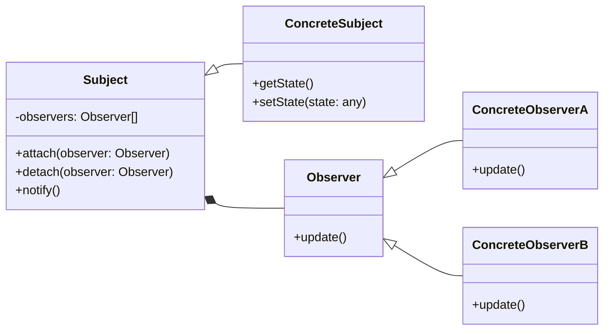

# Observer Pattern
The Observer pattern is a behavioral design pattern that allows objects to subscribe and receive notifications from one or more publishers (also known as subjects) when there is a change in their state. This pattern helps to decouple the subscriber and the publisher, allowing them to evolve independently without the need for constant polling.


## implemetation in python:
```python
class Subject:
    def __init__(self):
        self._observers = set()
        self._state = None

    def attach(self, observer):
        observer._subject = self
        self._observers.add(observer)

    def detach(self, observer):
        observer._subject = None
        self._observers.remove(observer)

    def notify(self):
        for observer in self._observers:
            observer.update()

    @property
    def state(self):
        return self._state

    @state.setter
    def state(self, state):
        self._state = state
        self.notify()

class Observer:
    def update(self):
        raise NotImplementedError

class ConcreteObserverA(Observer):
    def update(self):
        print("ConcreteObserverA received the update.")

class ConcreteObserverB(Observer):
    def update(self):
        print("ConcreteObserverB received the update.")

subject = Subject()
observer_a = ConcreteObserverA()
observer_b = ConcreteObserverB()

subject.attach(observer_a)
subject.attach(observer_b)

subject.state = 123

subject.detach(observer_a)

subject.state = "Hello, world!"

```
# JavaScrip implementation:

```js
class Subject {
  constructor() {
    this.observers = new Set();
    this.state = null;
  }

  attach(observer) {
    observer.subject = this;
    this.observers.add(observer);
  }

  detach(observer) {
    observer.subject = null;
    this.observers.delete(observer);
  }

  notify() {
    for (const observer of this.observers) {
      observer.update();
    }
  }
}

class Observer {
  constructor() {
    this.subject = null;
  }

  update() {
    throw new Error('update() method must be implemented.');
  }
}

class ConcreteObserverA extends Observer {
  update() {
    console.log('ConcreteObserverA received the update.');
  }
}

class ConcreteObserverB extends Observer {
  update() {
    console.log('ConcreteObserverB received the update.');
  }
}

const subject = new Subject();
const observerA = new ConcreteObserverA();
const observerB = new ConcreteObserverB();

subject.attach(observerA);
subject.attach(observerB);

subject.state = 123;

subject.detach(observerA);

subject.state = 'Hello, world!';

```

## [Back to main](../readme.md)