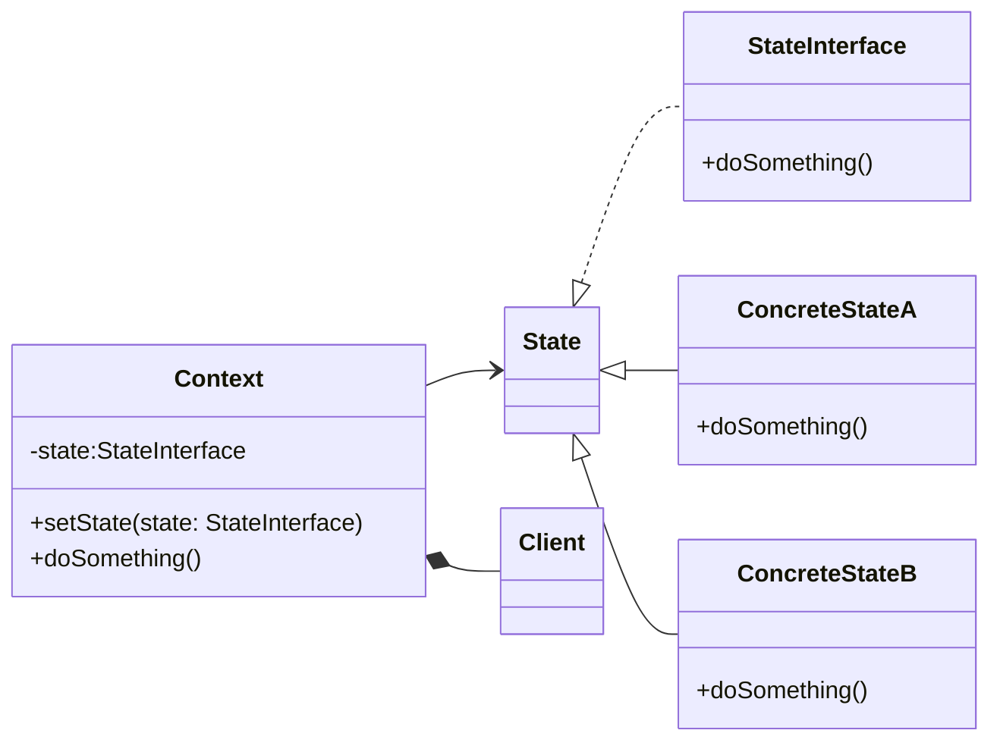

# State Pattern
The State pattern is a behavioral pattern that allows an object to change its behavior when its internal state changes. It helps to achieve better encapsulation by separating state-specific behavior into different classes.

In this pattern, we have a context class that has a state attribute. When the state changes, the context delegates the behavior to a state object. The state object defines its own behavior when its state is active.


## implemetation in python:
```python
from abc import ABC, abstractmethod

class State(ABC):
    @abstractmethod
    def handle(self):
        pass

class ConcreteStateA(State):
    def handle(self):
        print("Handling request in ConcreteStateA")

class ConcreteStateB(State):
    def handle(self):
        print("Handling request in ConcreteStateB")

class Context:
    def __init__(self, state):
        self._state = state

    def request(self):
        self._state.handle()

    def set_state(self, state):
        self._state = state

if __name__ == '__main__':
    context = Context(ConcreteStateA())
    context.request()

    context.set_state(ConcreteStateB())
    context.request()
```
# JavaScrip implementation:

```js
class State {
  handle() {}
}

class ConcreteStateA extends State {
  handle() {
    console.log("Handling request in ConcreteStateA");
  }
}

class ConcreteStateB extends State {
  handle() {
    console.log("Handling request in ConcreteStateB");
  }
}

class Context {
  constructor(state) {
    this._state = state;
  }

  request() {
    this._state.handle();
  }

  set state(state) {
    this._state = state;
  }
}

const context = new Context(new ConcreteStateA());
context.request();

context.state = new ConcreteStateB();
context.request();

```

## [Back to main](../readme.md)