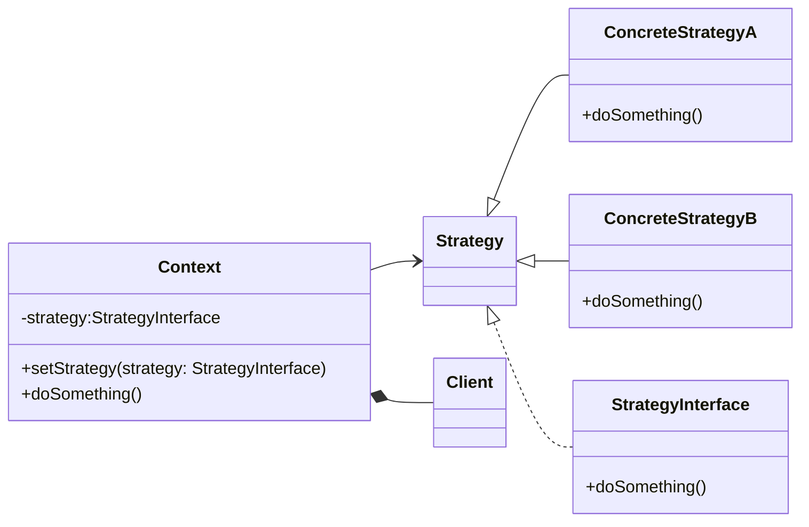

# Strategy Pattern
The Strategy pattern is a behavioral design pattern that allows you to define a family of algorithms, encapsulate each one as an object, and make them interchangeable at runtime. The strategy pattern lets the algorithm vary independently from clients that use it.

In the strategy pattern, we have a context that contains a reference to a strategy. The context may define an interface that is common to all supported strategies. The context delegates the work to the strategy that implements the algorithm. Clients can change the strategy of the context, which changes the algorithm executed by the context.


## implemetation in python:
```python
from abc import ABC, abstractmethod

class SortingStrategy(ABC):
    @abstractmethod
    def sort(self, data):
        pass

class QuickSortStrategy(SortingStrategy):
    def sort(self, data):
        # Implement QuickSort algorithm
        pass

class MergeSortStrategy(SortingStrategy):
    def sort(self, data):
        # Implement MergeSort algorithm
        pass

class DataSorter:
    def __init__(self, strategy):
        self.strategy = strategy

    def sort_data(self, data):
        return self.strategy.sort(data)

# Usage
data = [3, 1, 4, 1, 5, 9, 2, 6, 5, 3, 5]
sorter = DataSorter(QuickSortStrategy())
sorted_data = sorter.sort_data(data)
print(sorted_data)

```
# JavaScrip implementation:

```js
class SortingStrategy {
  sort(data) {
    // abstract method
  }
}

class QuickSortStrategy extends SortingStrategy {
  sort(data) {
    // Implement QuickSort algorithm
  }
}

class MergeSortStrategy extends SortingStrategy {
  sort(data) {
    // Implement MergeSort algorithm
  }
}

class DataSorter {
  constructor(strategy) {
    this.strategy = strategy;
  }

  sortData(data) {
    return this.strategy.sort(data);
  }
}

// Usage
let data = [3, 1, 4, 1, 5, 9, 2, 6, 5, 3, 5];
let sorter = new DataSorter(new QuickSortStrategy());
let sortedData = sorter.sortData(data);
console.log(sortedData);

```

## [Back to main](../readme.md)