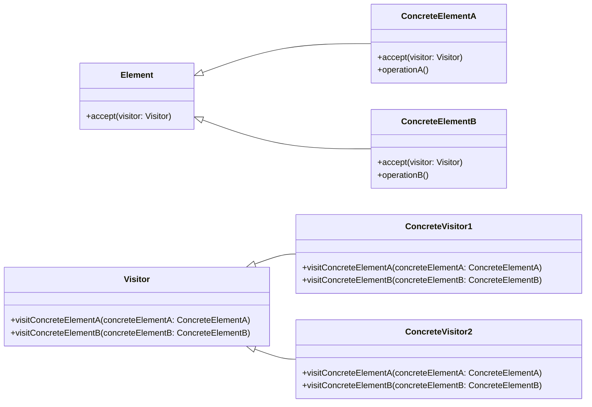

# Visitor Pattern
The Visitor Pattern is a behavioral design pattern that allows adding new operations to an object structure without modifying it. The pattern achieves this by separating the object structure from the operations that are performed on it.

The main idea behind the Visitor pattern is to define a separate object, called a visitor, that can traverse the object structure and perform operations on it. This way, the visitor can be used to perform different operations on the same object structure without modifying it.


## implemetation in python:
```python
from abc import ABC, abstractmethod

class Shape(ABC):
    @abstractmethod
    def accept(self, visitor):
        pass

class Circle(Shape):
    def __init__(self, radius):
        self.radius = radius

    def accept(self, visitor):
        visitor.visit_circle(self)

class Square(Shape):
    def __init__(self, length):
        self.length = length

    def accept(self, visitor):
        visitor.visit_square(self)

class Rectangle(Shape):
    def __init__(self, width, height):
        self.width = width
        self.height = height

    def accept(self, visitor):
        visitor.visit_rectangle(self)

class PerimeterVisitor:
    def __init__(self):
        self.total_perimeter = 0

    def visit_circle(self, circle):
        self.total_perimeter += 2 * 3.14 * circle.radius

    def visit_square(self, square):
        self.total_perimeter += 4 * square.length

    def visit_rectangle(self, rectangle):
        self.total_perimeter += 2 * (rectangle.width + rectangle.height)

class ShapeFactory:
    @staticmethod
    def create_circle(radius):
        return Circle(radius)

    @staticmethod
    def create_square(length):
        return Square(length)

    @staticmethod
    def create_rectangle(width, height):
        return Rectangle(width, height)

circle = ShapeFactory.create_circle(2)
square = ShapeFactory.create_square(4)
rectangle = ShapeFactory.create_rectangle(2, 4)

visitor = PerimeterVisitor()
circle.accept(visitor)
square.accept(visitor)
rectangle.accept(visitor)

print(visitor.total_perimeter)  # Output: 24.84
```
# JavaScrip implementation:

```js
class Shape {
  constructor(name) {
    this.name = name;
  }

  accept(visitor) {
    visitor.visit(this);
  }
}

class Rectangle extends Shape {
  constructor(width, height) {
    super('Rectangle');
    this.width = width;
    this.height = height;
  }
}

class Circle extends Shape {
  constructor(radius) {
    super('Circle');
    this.radius = radius;
  }
}

class PerimeterVisitor {
  visit(shape) {
    if (shape instanceof Rectangle) {
      console.log(`Perimeter of rectangle with width ${shape.width} and height ${shape.height} is ${2 * (shape.width + shape.height)}.`);
    } else if (shape instanceof Circle) {
      console.log(`Perimeter of circle with radius ${shape.radius} is ${2 * Math.PI * shape.radius}.`);
    }
  }
}

class AreaVisitor {
  visit(shape) {
    if (shape instanceof Rectangle) {
      console.log(`Area of rectangle with width ${shape.width} and height ${shape.height} is ${shape.width * shape.height}.`);
    } else if (shape instanceof Circle) {
      console.log(`Area of circle with radius ${shape.radius} is ${Math.PI * shape.radius ** 2}.`);
    }
  }
}

// Example usage
const rectangle = new Rectangle(4, 6);
const circle = new Circle(3);

const perimeterVisitor = new PerimeterVisitor();
const areaVisitor = new AreaVisitor();

rectangle.accept(perimeterVisitor);
rectangle.accept(areaVisitor);

circle.accept(perimeterVisitor);
circle.accept(areaVisitor);

```

## [Back to main](../readme.md)