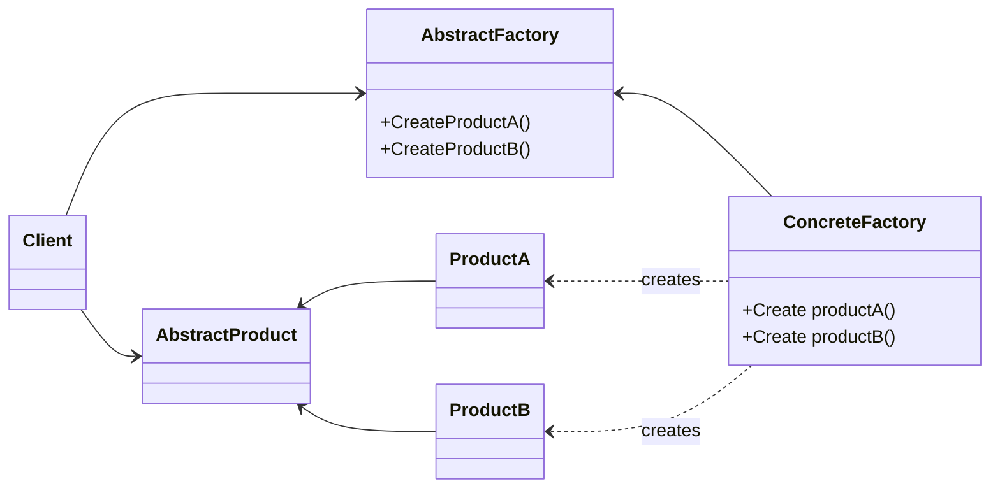

# Abstract Factory
Provides an interface for creating families of related or dependent objects without specifying their concrete classes
---


## implemetation in python:
[wikipedia](https://en.wikipedia.org/wiki/Abstract_factory_pattern)
```python
from abc import ABC, abstractmethod
from sys import platform


class Button(ABC):
    @abstractmethod
    def paint(self):
        pass


class LinuxButton(Button):
    def paint(self):
        return "Render a button in a Linux style"


class WindowsButton(Button):
    def paint(self):
        return "Render a button in a Windows style"


class MacOSButton(Button):
    def paint(self):
        return "Render a button in a MacOS style"


class GUIFactory(ABC):
    @abstractmethod
    def create_button(self):
        pass


class LinuxFactory(GUIFactory):
    def create_button(self):
        return LinuxButton()


class WindowsFactory(GUIFactory):
    def create_button(self):
        return WindowsButton()


class MacOSFactory(GUIFactory):
    def create_button(self):
        return MacOSButton()


if platform == "linux":
    factory = LinuxFactory()
elif platform == "darwin":
    factory = MacOSFactory()
elif platform == "win32":
    factory = WindowsFactory()
else:
    raise NotImplementedError(f"Not implemented for your platform: {platform}")

button = factory.create_button()
result = button.paint()
print(result)
```
> TODO implementation in JS:

## [Back to main](../readme.md)