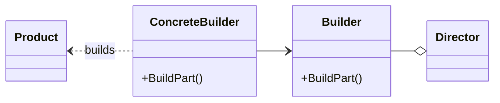

# Builder pattern
Separates the construction of a complex object from its representation so that the same construction process can create different representations.
---
$~$

$~$
## implemetation in python:
<a href="https://en.wikipedia.org/wiki/Builder_pattern#:~:text=The%20builder%20pattern%20is%20a,Gang%20of%20Four%20design%20patterns." target="_blank">WIKIPEDIA BUILDER PATTERN</a>
```python
"""
Builder Concept Sample Code
https://sbcode.net/python/builder/#builderbuilder_conceptpy
"""
from abc import ABCMeta, abstractmethod

class IBuilder(metaclass=ABCMeta):
    "The Builder Interface"

    @staticmethod
    @abstractmethod
    def build_part_a():
        "Build part a"

    @staticmethod
    @abstractmethod
    def build_part_b():
        "Build part b"

    @staticmethod
    @abstractmethod
    def build_part_c():
        "Build part c"

    @staticmethod
    @abstractmethod
    def get_result():
        "Return the final product"

class Builder(IBuilder):
    "The Concrete Builder."

    def __init__(self):
        self.product = Product()

    def build_part_a(self):
        self.product.parts.append('a')
        return self

    def build_part_b(self):
        self.product.parts.append('b')
        return self

    def build_part_c(self):
        self.product.parts.append('c')
        return self

    def get_result(self):
        return self.product

class Product():
    "The Product"

    def __init__(self):
        self.parts = []

class Director:
    "The Director, building a complex representation."

    @staticmethod
    def construct():
        "Constructs and returns the final product"
        return Builder()\
            .build_part_a()\
            .build_part_b()\
            .build_part_c()\
            .get_result()

# The Client
PRODUCT = Director.construct()
print(PRODUCT.parts)
```
# JavaScrip implementation:

```js
let Task = function(name, description, finished, dueDate) {

    this.name = name;
    this.description = description;
    this.finished = finished;
    this.dueDate = dueDate;
}

let TaskBuilder = function () {

    let name;
    let description;
    let isFinished = false;
    let dueDate;

    return {
        setName: function (name) {
            this.name = name;
            return this;
        },
        setDescription: function (description) {
            this.description = description;
            return this;
        },
        setFinished: function (finished) {
            this.finished = finished;
            return this;
        },
        setDueDate: function (dueDate) {
            this.dueDate = dueDate;
            return this;
        },
        build: function () {
            return new Task(name, description, isFinished, dueDate);
        }
    };
};

let task = new TaskBuilder().setName('Task A').setDescription('finish book')
    .setDueDate(new Date(2019, 5, 12));
console.log(task);
```

## [Back to main](../readme.md)