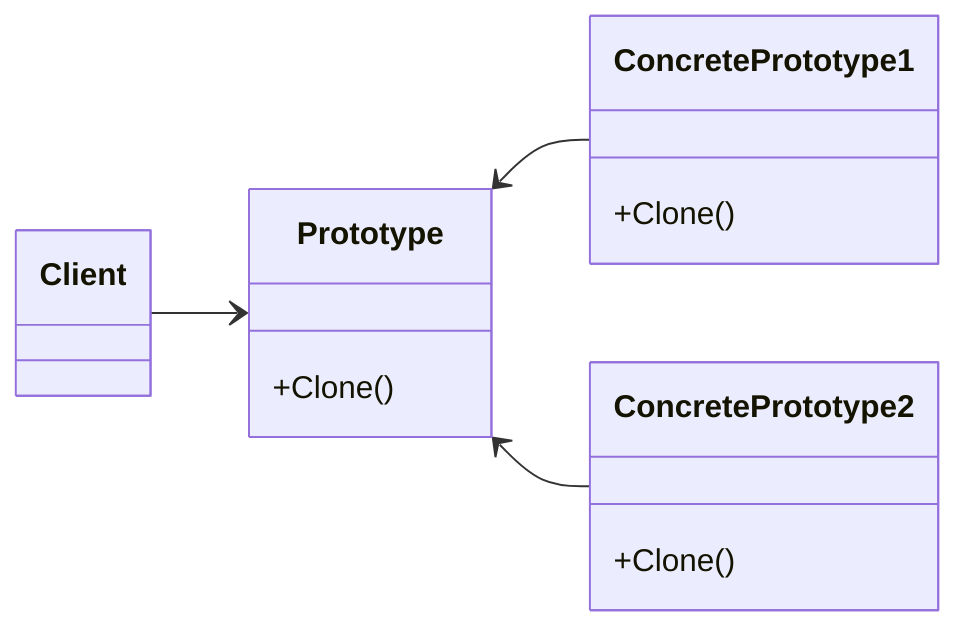

# Prototype
Specifies the kinds of objects to create using a prototypical instance and create new objects by copying this prototype
---
$~$

$~$
## implemetation in Python:
<a href="" target="_blank">WIKIPEDIA BUILDER PATTERN</a>
```python
# TODO
```
# Implementation in JavaScript:

```js
// TODO
```

## [Back to main](../readme.md)