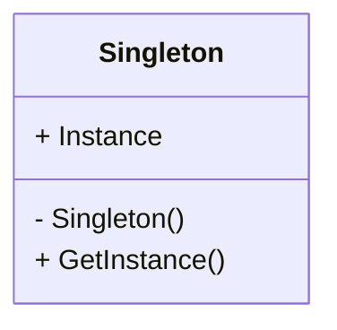

# Singleton
Ensure a class only has one instance and provide a global point of access to it
---

## implemetation in Python:
<a href="" target="_blank">WIKIPEDIA BUILDER PATTERN</a>
```python
class Singleton:
    _instance = None

    def __new__(cls):
        if cls._instance is None:
            cls._instance = super().__new__(cls)
        return cls._instance

    def __init__(self):
        self.state = "initialized"

    def some_method(self):
        print(f"Singleton state: {self.state}")

if __name__ == "__main__":
    s1 = Singleton()
    s2 = Singleton()

    print(f"s1 is s2: {s1 is s2}")

    s1.state = "modified"
    s2.some_method()

```
# Implementation in JavaScrip:

```js
class Singleton {
  static instance;

  constructor() {
    if (Singleton.instance) {
      return Singleton.instance;
    }

    this.state = "initialized";
    Singleton.instance = this;
  }

  someMethod() {
    console.log(`Singleton state: ${this.state}`);
  }
}

// Usage
const s1 = new Singleton();
const s2 = new Singleton();

console.log(`s1 is s2: ${s1 === s2}`);

s1.state = "modified";
s2.someMethod();

```

## [Back to main](../readme.md)