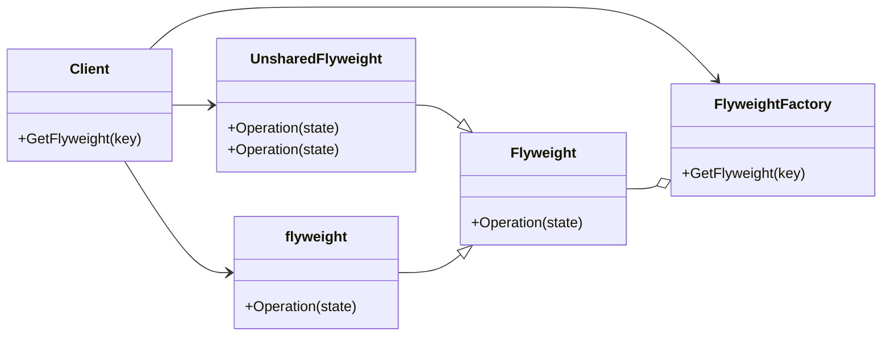

# Flyweight
Uses sharing to support large numbers of fine-grained objects efficiently
---
$~$

$~$
## implemetation in Python:
<a href="" target="_blank">WIKIPEDIA BUILDER PATTERN</a>
```python
# TODO
```
# Implementation in JavaScrip:

```js
// TODO
```

## [Back to main](../readme.md)