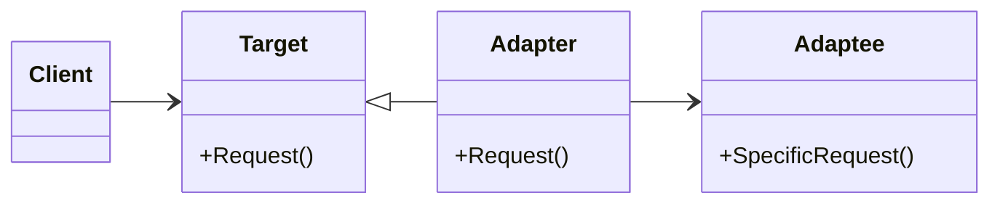

# Adapter
Converts the interface of a class into another interface clients expect

---


## implemetation in Python:
<a href="" target="_blank">WIKIPEDIA BUILDER PATTERN</a>
```python
class LegacyClass:
    def request(self, param1, param2):
        print(f"LegacyClass received {param1} and {param2}")

class Adapter:
    def __init__(self, legacy_class):
        self.legacy_class = legacy_class

    def new_request(self, param):
        self.legacy_class.request(param, None)

# Using the Adapter
legacy_instance = LegacyClass()
adapter_instance = Adapter(legacy_instance)
adapter_instance.new_request("test")
```
# Implementation in JavaScrip:

```js
class NewApp {
  process(data) {
    console.log(`NewApp processed ${data}`);
  }
}

class OldData {
  constructor(data) {
    this.data = data;
  }

  getOldData() {
    return this.data;
  }
}

class Adapter {
  constructor(oldData) {
    this.oldData = oldData;
  }

  getNewData() {
    return this.oldData.getOldData().toUpperCase();
  }
}

// Using the Adapter
const oldDataInstance = new OldData("test");
const adapterInstance = new Adapter(oldDataInstance);
const newAppInstance = new NewApp();
newAppInstance.process(adapterInstance.getNewData());
```

## [Back to main](../readme.md)