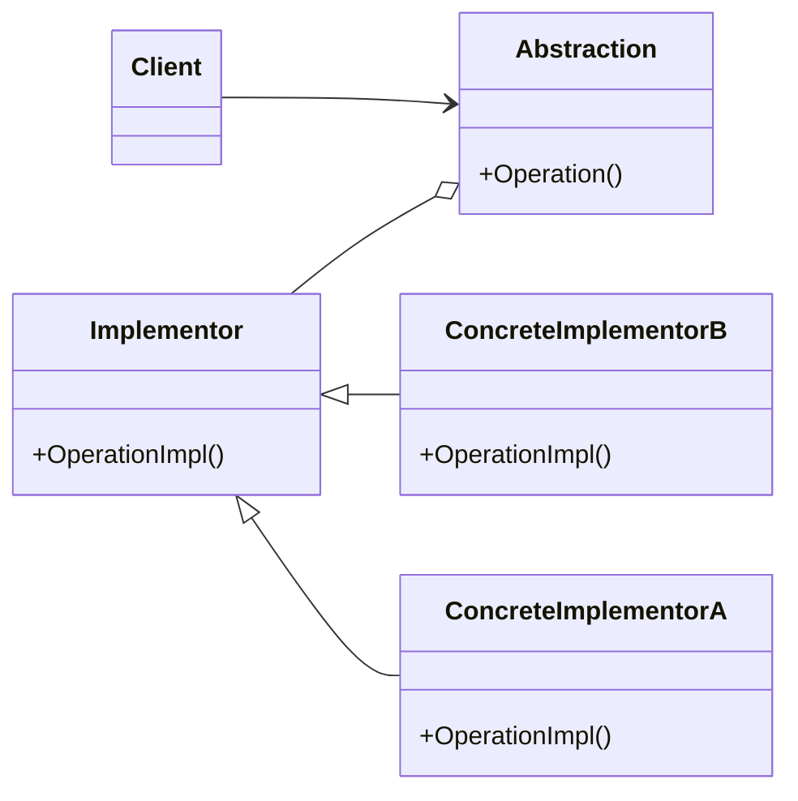

# Bridge
Decouples an abstraction from its implementation so that the two can vary independently
---

## implemetation in Python:
<a href="" target="_blank">WIKIPEDIA BUILDER PATTERN</a>
```python
class Shape:
    def __init__(self, renderer):
        self.renderer = renderer

    def draw(self):
        pass

class Square(Shape):
    def draw(self):
        self.renderer.render_square()

class Circle(Shape):
    def draw(self):
        self.renderer.render_circle()

class Renderer:
    def render_square(self):
        pass

    def render_circle(self):
        pass

class VectorRenderer(Renderer):
    def render_square(self):
        print("Drawing a square in vector format")

    def render_circle(self):
        print("Drawing a circle in vector format")

class RasterRenderer(Renderer):
    def render_square(self):
        print("Drawing a square in raster format")

    def render_circle(self):
        print("Drawing a circle in raster format")

# Using the Bridge
vector_renderer = VectorRenderer()
raster_renderer = RasterRenderer()

square = Square(vector_renderer)
square.draw()  # Output: Drawing a square in vector format

circle = Circle(raster_renderer)
circle.draw()  # Output: Drawing a circle in raster format
```
# Implementation in JavaScrip:

```js
class Vehicle {
  constructor(engine) {
    this.engine = engine;
  }

  specs() {
    return "";
  }
}

class Car extends Vehicle {
  specs() {
    return `This is a car with ${this.engine.type} engine`;
  }
}

class Bike extends Vehicle {
  specs() {
    return `This is a bike with ${this.engine.type} engine`;
  }
}

class Engine {
  constructor(type) {
    this.type = type;
  }
}

class PetrolEngine extends Engine {
  constructor() {
    super("petrol");
  }
}

class DieselEngine extends Engine {
  constructor() {
    super("diesel");
  }
}

// Using the Bridge
const petrolEngine = new PetrolEngine();
const dieselEngine = new DieselEngine();

const car = new Car(petrolEngine);
console.log(car.specs()); // Output: This is a car with petrol engine

const bike = new Bike(dieselEngine);
console.log(bike.specs()); // Output: This is a bike with diesel engine
```

## [Back to main](../readme.md)