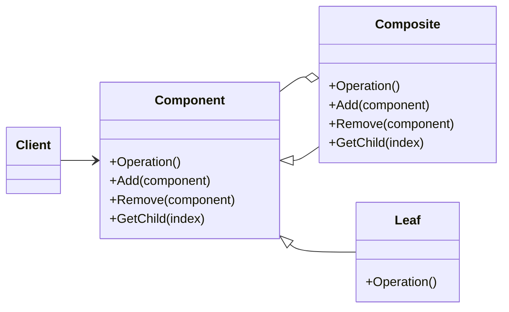

# Composite
Composes objects into tree structures to represent part-whole hierarchies
---
$~$

$~$
## implemetation in Python:
<a href="" target="_blank">WIKIPEDIA BUILDER PATTERN</a>
```python
"""
Bridge pattern example.
"""
from abc import ABCMeta, abstractmethod


NOT_IMPLEMENTED = "You should implement this."


class DrawingAPI:
    __metaclass__ = ABCMeta

    @abstractmethod
    def draw_circle(self, x, y, radius):
        raise NotImplementedError(NOT_IMPLEMENTED)


class DrawingAPI1(DrawingAPI):
    def draw_circle(self, x, y, radius):
        return f"API1.circle at {x}:{y} - radius: {radius}"


class DrawingAPI2(DrawingAPI):
    def draw_circle(self, x, y, radius):
        return f"API2.circle at {x}:{y} - radius: {radius}"


class DrawingAPI3(DrawingAPI):
    def draw_circle(self, x, y, radius):
        return f"API3.circle at {x}:{y} - radius: {radius}"


class Shape:
    __metaclass__ = ABCMeta

    drawing_api = None
    def __init__(self, drawing_api):
        self.drawing_api = drawing_api

    @abstractmethod
    def draw(self):
        raise NotImplementedError(NOT_IMPLEMENTED)

    @abstractmethod
    def resize_by_percentage(self, percent):
        raise NotImplementedError(NOT_IMPLEMENTED)


class CircleShape(Shape):
    def __init__(self, x, y, radius, drawing_api):
        self.x = x
        self.y = y
        self.radius = radius
        super(CircleShape, self).__init__(drawing_api)


    def draw(self):
        return self.drawing_api.draw_circle(self.x, self.y, self.radius)

    def resize_by_percentage(self, percent):
        self.radius *= 1 + percent / 100


class BridgePattern:
    @staticmethod
    def test():
        shapes = [
            CircleShape(1.0, 2.0, 3.0, DrawingAPI1()),
            CircleShape(5.0, 7.0, 11.0, DrawingAPI2()),
            CircleShape(5.0, 4.0, 12.0, DrawingAPI3()),
        ]

        for shape in shapes:
            shape.resize_by_percentage(2.5)
            print(shape.draw())


BridgePattern.test()
```
# Implementation in JavaScrip:

```js
// TODO
```

## [Back to main](../readme.md)