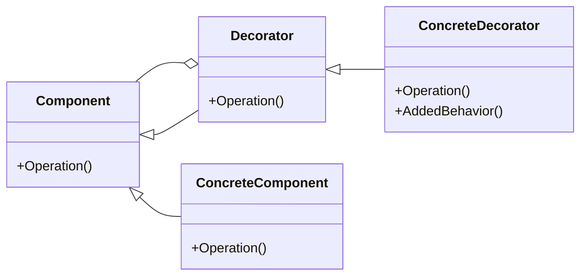

# Decorator
Attaches additional responsibilities to an object dynamically
---

## implemetation in Python:
Let's say we have a coffee shop that serves different types of coffee, and we want to be able to add different types of toppings to the coffee. We can use the Decorator pattern to dynamically add toppings to the coffee without changing its interface. Here's an example:
```python
class Coffee:
    def get_cost(self):
        return 2.0

    def get_description(self):
        return "Coffee"

class ToppingDecorator(Coffee):
    def __init__(self, coffee):
        self.coffee = coffee

    def get_cost(self):
        return self.coffee.get_cost()

    def get_description(self):
        return self.coffee.get_description()

class Milk(ToppingDecorator):
    def __init__(self, coffee):
        super().__init__(coffee)

    def get_cost(self):
        return self.coffee.get_cost() + 1.0

    def get_description(self):
        return self.coffee.get_description() + ", Milk"

class Sugar(ToppingDecorator):
    def __init__(self, coffee):
        super().__init__(coffee)

    def get_cost(self):
        return self.coffee.get_cost() + 0.5

    def get_description(self):
        return self.coffee.get_description() + ", Sugar"

# Using the Decorator
coffee = Coffee()
coffee_with_milk = Milk(coffee)
coffee_with_milk_and_sugar = Sugar(coffee_with_milk)

print(coffee_with_milk_and_sugar.get_description())  # Output: Coffee, Milk, Sugar
print(coffee_with_milk_and_sugar.get_cost())  # Output: 3.5
```
# Implementation in JavaScrip:
Let's say we have a car rental company that rents out different types of cars, and we want to be able to add different types of options to the cars, such as GPS, child seat, and insurance. We can use the Decorator pattern to dynamically add options to the cars without changing their interface. Here's an example:
```js
class Car {
  constructor() {
    this.description = "Car";
  }

  getCost() {
    return 10.0;
  }

  getDescription() {
    return this.description;
  }
}

class CarOption extends Car {
  constructor(car) {
    super();
    this.car = car;
  }

  getCost() {
    return this.car.getCost();
  }

  getDescription() {
    return this.car.getDescription();
  }
}

class GPS extends CarOption {
  constructor(car) {
    super(car);
    this.description = "GPS";
  }

  getCost() {
    return this.car.getCost() + 5.0;
  }

  getDescription() {
    return `${this.car.getDescription()}, ${this.description}`;
  }
}

class ChildSeat extends CarOption {
  constructor(car) {
    super(car);
    this.description = "Child Seat";
  }

  getCost() {
    return this.car.getCost() + 2.0;
  }

  getDescription() {
    return
```

## [Back to main](../readme.md)