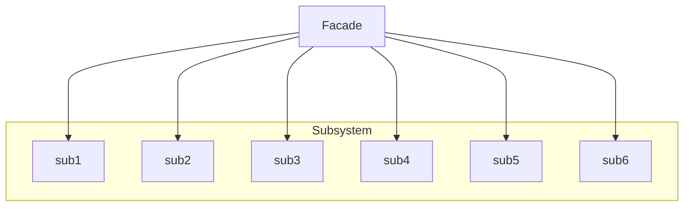

# Facade
Provides a unified interface to a set of interfaces in a subsystem
---

## implemetation in Python:
Let's say we have a complex system for playing different types of media files, such as mp3, mp4, avi, etc. We can use the Facade pattern to provide a simple interface for the client to play different types of media files. Here's an example:
```python
class AudioPlayer:
    def play_audio(self, file_name):
        print(f"Playing audio file: {file_name}")

class VideoPlayer:
    def play_video(self, file_name):
        print(f"Playing video file: {file_name}")

class MediaPlayer:
    def __init__(self):
        self.audio_player = AudioPlayer()
        self.video_player = VideoPlayer()

    def play(self, file_name):
        if file_name.endswith(".mp3"):
            self.audio_player.play_audio(file_name)
        elif file_name.endswith(".mp4") or file_name.endswith(".avi"):
            self.video_player.play_video(file_name)
        else:
            print(f"Cannot play file: {file_name}")

# Using the Facade
media_player = MediaPlayer()
media_player.play("audio.mp3")
media_player.play("video.mp4")
media_player.play("document.docx")  # Output: Cannot play file: document.docx

```
# Implementation in JavaScrip:
Let's say we have a complex system for managing a shopping cart on an e-commerce website, where we need to perform multiple operations such as adding products, removing products, updating quantities, etc. We can use the Facade pattern to provide a simple interface for the client to manage the shopping cart. Here's an example:
```js
class Product {
  constructor(name, price) {
    this.name = name;
    this.price = price;
  }
}

class ShoppingCart {
  constructor() {
    this.products = [];
  }

  addProduct(product) {
    this.products.push(product);
    console.log(`Added product: ${product.name} - ${product.price}`);
  }

  removeProduct(product) {
    const index = this.products.indexOf(product);
    if (index >= 0) {
      this.products.splice(index, 1);
      console.log(`Removed product: ${product.name} - ${product.price}`);
    }
  }

  updateQuantity(product, quantity) {
    product.quantity = quantity;
    console.log(`Updated quantity for product: ${product.name} - ${product.price}`);
  }

  checkout() {
    let total = 0;
    for (const product of this.products) {
      total += product.price * (product.quantity || 1);
    }
    console.log(`Total: ${total}`);
  }
}

class ShoppingCartFacade {
  constructor() {
    this.shoppingCart = new ShoppingCart();
  }

  addProduct(name, price) {
    const product = new Product(name, price);
    this.shoppingCart.addProduct(product);
  }

  removeProduct(name) {
    const product = this.shoppingCart.products.find(product => product.name === name);
    if (product) {
      this.shoppingCart.removeProduct(product);
    }
  }

  updateQuantity(name, quantity)

```

## [Back to main](../readme.md)