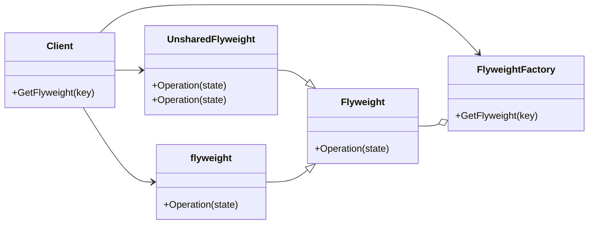

# Flyweight
Uses sharing to support large numbers of fine-grained objects efficiently
---

## implemetation in Python:
Let's say we have a game where we need to create many trees with different positions, colors, and textures. We can use the Flyweight pattern to minimize memory usage by creating a single instance of a tree with shared properties and multiple instances of a tree with unique properties. Here's an example:
```python
class Tree:
    def __init__(self, x, y, color, texture):
        self.x = x
        self.y = y
        self.color = color
        self.texture = texture

class TreeFlyweight:
    def __init__(self, color, texture):
        self.color = color
        self.texture = texture

    def create_tree(self, x, y):
        return Tree(x, y, self.color, self.texture)

class TreeFactory:
    flyweights = {}

    def get_tree_flyweight(self, color, texture):
        key = f"{color}-{texture}"
        if key not in self.flyweights:
            self.flyweights[key] = TreeFlyweight(color, texture)
        return self.flyweights[key]

    def create_tree(self, x, y, color, texture):
        flyweight = self.get_tree_flyweight(color, texture)
        return flyweight.create_tree(x, y)

# Using the Flyweight
factory = TreeFactory()
tree1 = factory.create_tree(0, 0, "green", "pine")
tree2 = factory.create_tree(1, 1, "green", "pine")
tree3 = factory.create_tree(2, 2, "red", "maple")
tree4 = factory.create_tree(3, 3, "red", "maple")

```
# Implementation in JavaScrip:
Let's say we have a program that generates a large number of buttons with different styles and text content. We can use the Flyweight pattern to reduce the number of DOM elements created and improve performance. Here's an example:
```js
class Button {
  constructor(style) {
    this.style = style;
  }

  render(x, y, text) {
    const button = document.createElement("button");
    button.style.backgroundColor = this.style.backgroundColor;
    button.style.color = this.style.color;
    button.style.fontWeight = this.style.fontWeight;
    button.style.borderRadius = this.style.borderRadius;
    button.style.padding = this.style.padding;
    button.style.position = "absolute";
    button.style.left = x + "px";
    button.style.top = y + "px";
    button.textContent = text;
    document.body.appendChild(button);
  }
}

class ButtonFactory {
  buttons = {};

  getButton(style) {
    if (!this.buttons[style.backgroundColor]) {
      this.buttons[style.backgroundColor] = new Button(style);
    }
    return this.buttons[style.backgroundColor];
  }
}

// Using the Flyweight
const styles = [
  { backgroundColor: "red", color: "white", fontWeight: "bold", borderRadius: "10px", padding: "5px" },
  { backgroundColor: "blue", color: "white", fontWeight: "bold", borderRadius: "10px", padding: "5px" },
  { backgroundColor: "green", color: "white", fontWeight: "bold", borderRadius: "10px", padding: "5px" },
  { backgroundColor: "yellow", color: "black", fontWeight: "normal", borderRadius: "5px", padding: "3px" },
];

const factory = new ButtonFactory();
for (let i = 0; i < 100; i++) {
  const style = styles[i % 4];
  const button = factory.getButton(style);
  button.render(i * 20, i * 20, `Button ${i + 1}`);
}
```

## [Back to main](../readme.md)