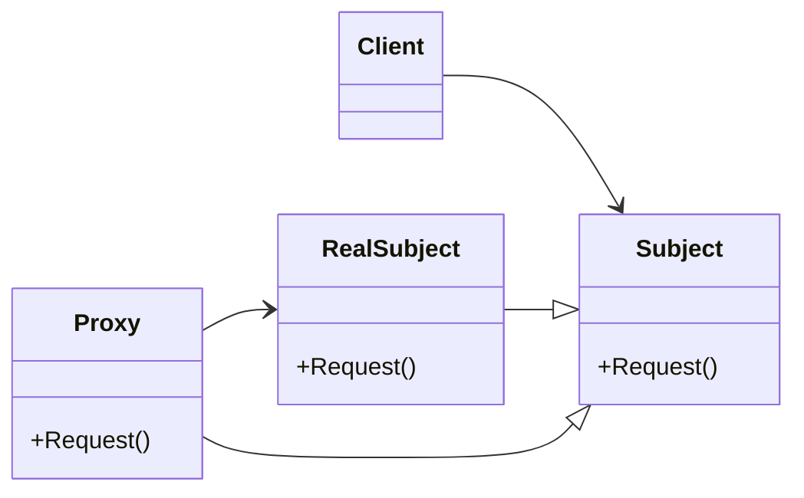

# Proxy
Provides a surrogate or placeholder for another object to control access to it
---

## implemetation in Python:
<a href="" target="_blank">WIKIPEDIA BUILDER PATTERN</a>
```python
from time import sleep

class RealSubject:
    def request(self):
        print("RealSubject: Handling request.")

class Proxy:
    def __init__(self, real_subject: RealSubject) -> None:
        self._real_subject = real_subject

    def request(self) -> None:
        if self.check_access():
            self._real_subject.request()
            self.log_access()

    def check_access(self) -> bool:
        print("Proxy: Checking access prior to firing a real request.")
        sleep(1)
        return True

    def log_access(self) -> None:
        print("Proxy: Logging the time of request.")

if __name__ == "__main__":
    real_subject = RealSubject()
    proxy = Proxy(real_subject)

    proxy.request()

```
# Implementation in JavaScrip:

```js
class RealSubject {
  request() {
    console.log("RealSubject: Handling request.");
  }
}

class Proxy {
  constructor(realSubject) {
    this.realSubject = realSubject;
  }

  request() {
    if (this.checkAccess()) {
      this.realSubject.request();
      this.logAccess();
    }
  }

  checkAccess() {
    console.log("Proxy: Checking access prior to firing a real request.");
    return true;
  }

  logAccess() {
    console.log("Proxy: Logging the time of request.");
  }
}

// Usage
const realSubject = new RealSubject();
const proxy = new Proxy(realSubject);

proxy.request();

```

## [Back to main](../readme.md)