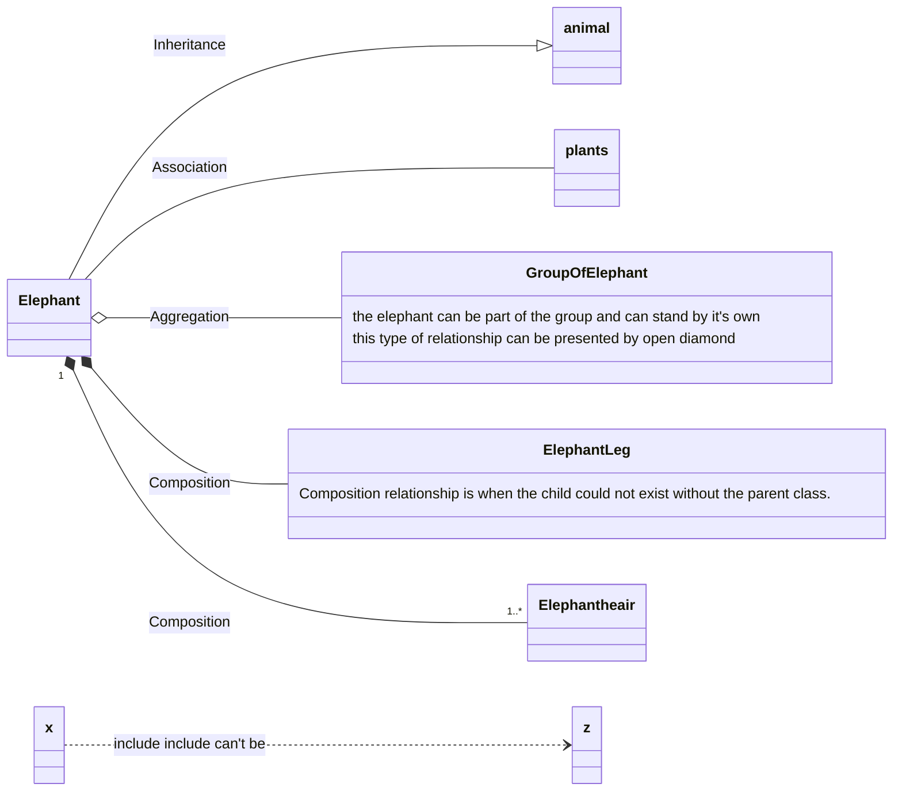

# [UML Class Diagram](https://www.youtube.com/watch?v=UI6lqHOVHic)
# [Class diagrams](https://github.com/mermaidjs/mermaidjs.github.io/blob/master/classDiagram.md)

```mermaid
classDiagram
direction LR
 Elephant--|> animal :Inheritance
 Elephant-- plants :Association
 Elephant o-- GroupOfElephant :Aggregation
 Elephant *-- ElephantLeg :Composition
 Elephant "1" *-- "1..*" Elephantheair :Composition
 x ..>z :include include can't be
  class GroupOfElephant {
     the elephant can be part of the group and can stand by it's own
     this type of relationship can be presented by open diamond
 }

 class ElephantLeg {
     Composition relationship is when the child could not exist without the parent class.
 }


```